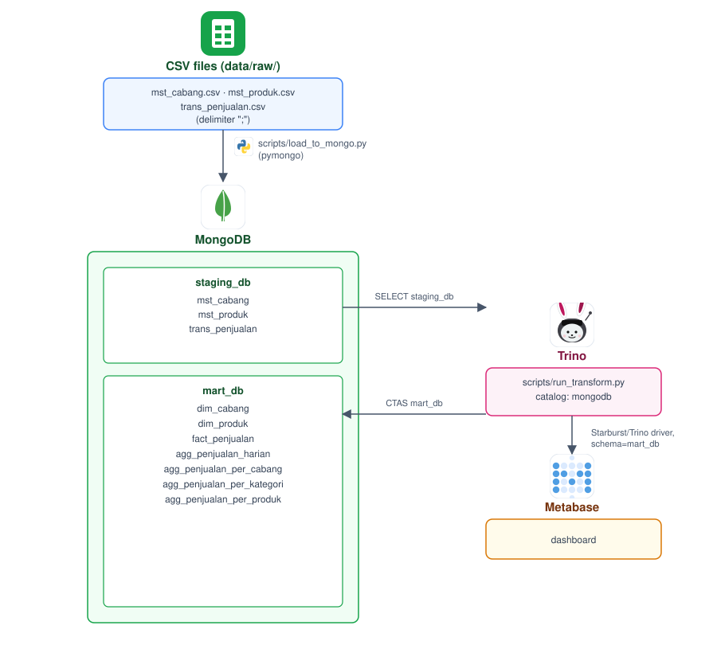

# mongodb-trino-metabase

Retail sales analytics dashboard: raw CSV data loaded into MongoDB via a
pymongo script, transformed into datamarts via Trino SQL, visualized in Metabase. Demonstrates a
3-layer staging -> warehouse -> datamart pattern on top of MongoDB, with Trino as both transform
and query engine.

## Architecture



## Stack

| Layer | Tool |
|---|---|
| Source | 3 CSV files (`mst_cabang`, `mst_produk`, `trans_penjualan`) in `data/raw/` |
| Extract/Load | `pipeline/staging.py` (pymongo, CSV -> MongoDB `stg_db`) |
| Database | MongoDB (`stg_db` staging, `dwh_db` warehouse, `dm_db` datamart) |
| Transform | Trino (MongoDB connector), driven by `pipeline/datawarehouse.py` and `pipeline/datamart.py` |
| Dashboard | Metabase (Starburst/Trino driver) |

## Data layers

| Layer | DB (MongoDB) | Table prefix | Contents |
|---|---|---|---|
| Staging | `stg_db` | `stg_` | Raw CSV rows, 1:1 with source files (`stg_mst_cabang`, `stg_mst_produk`, `stg_trans_penjualan`) |
| Warehouse | `dwh_db` | `dim_` / `fact_` | Cleaned/parsed dimensions and facts (`dim_cabang`, `dim_produk`, `fact_penjualan`) |
| Datamart | `dm_db` | `dm_` | Pre-aggregated tables for the dashboard (`dm_penjualan_harian`, `dm_penjualan_per_cabang`, `dm_penjualan_per_kategori`, `dm_penjualan_per_produk`) |


## Setup

1. Copy the env template and adjust if needed:
   ```bash
   cp .env.example .env
   ```
   Make sure `MONGO_USER`/`MONGO_PASSWORD` here match `trino/catalog/mongodb.properties`
   (Trino catalog files don't support env var substitution).

2. Start MongoDB, Trino, and Metabase:
   ```bash
   docker compose up -d
   ```

3. Create a virtualenv, install dependencies, then run the pipeline in order: load the CSVs into
   `stg_db`, build `dwh_db`, then build `dm_db`:
   ```bash
   python -m venv .venv
   source .venv/bin/activate   # Windows: .venv\Scripts\activate
   pip install -r requirements.txt
   python pipeline/staging.py
   python pipeline/datawarehouse.py
   python pipeline/datamart.py
   ```
   Or run all three in one go:
   ```bash
   python pipeline/staging.py && python pipeline/datawarehouse.py && python pipeline/datamart.py
   ```

4. Connect Metabase to Trino:
   - Open Metabase at `http://localhost:3000` and complete first-run admin setup.
   - **Admin settings -> Databases -> Add database**:
     - **Database type:** Starburst / Trino (`MB_DB_TYPE=starburst` in `.env`)
     - **Host:** `trino` (Docker Compose service name), **Port:** `8080`
     - **Catalog:** `mongodb` (`MB_DB_CATALOG`)
     - **Schema (schema filter, "only these"):** `dm_db` (`MB_DB_SCHEMA`) — this restricts
       Metabase to the `dm_db` (datamart) schema only, so it **cannot** browse or query the
       `stg_db` (staging) or `dwh_db` (warehouse) layers, even though all three live under the
       same Trino `mongodb` catalog.
     - **User:** value of `TRINO_USER`
   - Sync/scan the database once tables exist (i.e. after running `pipeline/datawarehouse.py`
     and `pipeline/datamart.py`).

## Tests

Unit tests mirror the top-level layout — `tests/pipeline/` for `pipeline/` (CSV parsing, SQL
statement splitting, the Trino retry loop, each script's entrypoint), `tests/trino/` for the real
`.sql` files (parses every file and checks it reads/writes the right schema for its layer). All
run against mocked MongoDB/Trino clients — no live services required. Uses the same
`requirements.txt` as Setup step 3, so if you already ran that, just run:

```bash
pytest
```

## Repo structure

```
mongodb-trino-metabase/
├── docker-compose.yml          # MongoDB, Trino, Metabase
├── .env / .env.example
├── requirements.txt
├── data/raw/                   # source CSVs
├── trino/
│   ├── catalog/mongodb.properties
│   └── transform/
│       ├── datawarehouse/       # 00_..03_ numbered SQL: stg_db -> dwh_db (dim_/fact_)
│       └── datamart/            # 00_..04_ numbered SQL: dwh_db -> dm_db (dm_)
├── pipeline/
│   ├── staging.py               # loads data/raw/*.csv into stg_db (pymongo)
│   ├── datawarehouse.py         # runs trino/transform/datawarehouse/*.sql
│   ├── datamart.py              # runs trino/transform/datamart/*.sql
│   └── trino_utils.py           # shared Trino connect/retry/run-sql-file helpers
├── tests/
│   ├── conftest.py             # puts the repo root on sys.path
│   ├── pipeline/                # tests for the top-level pipeline/ folder
│   │   ├── test_staging.py
│   │   ├── test_trino_utils.py
│   │   ├── test_datawarehouse.py
│   │   └── test_datamart.py
│   └── trino/                   # tests for the real trino/transform/*.sql files
│       └── test_transform_files.py
├── metabase/
│   └── retail-sales-dashboard.png  # screenshot of the built Metabase dashboard
└── docs/architecture.svg
```

## Stopping

```bash
docker compose down
```

Use `docker compose down -v` to also remove everything, including MongoDB and Metabase data.
